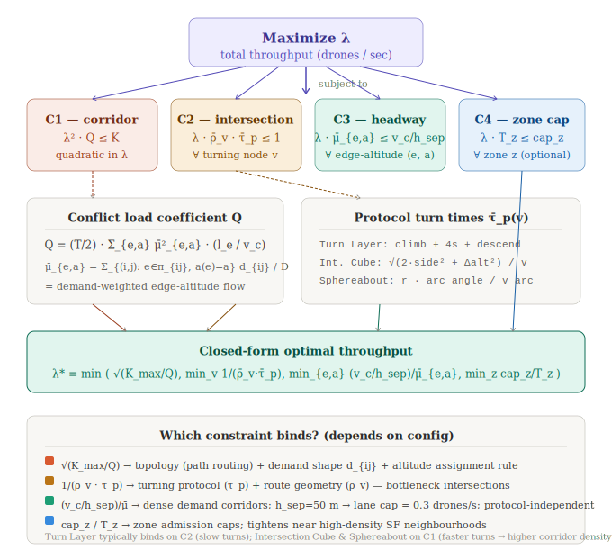

# Throughput Optimization Formulation

**IEOR 290 — Transportation Analytics, UC Berkeley, Spring 2026**  
**Team:** Sanchit Arvind, Constantin Ertel, JP Schuchter, Shreya Krishnan

---

## Overview

This document formalizes the **throughput optimization problem** for our
decentralized drone delivery airspace. The question it answers:

> *Given a demand distribution over San Francisco, what is the maximum number
> of drones that can operate per unit time under each (topology, turning
> protocol) configuration while keeping expected conflicts below a budget
> $K_{\max}$?*

The key insight is that **routing is deterministic** in our system: the
altitude-by-heading rule maps each OD pair to a unique shortest path with a
fixed altitude assignment. This collapses the problem from a complex
combinatorial routing program to a single scalar optimization over the
arrival rate $\lambda$.

---

## Diagram



---

## Sets and Parameters

| Symbol | Definition |
|--------|------------|
| $G = (V, E)$ | Street network (OSMnx for SF, abstract grid otherwise) |
| $A$ | Set of altitude bands ($\|A\| = 4$ for grid, $8$ for diagonal overlay) |
| $\mathcal{P}$ | Set of OD pairs $(i, j)$ |
| $\pi_{ij}$ | Deterministic shortest path from $i$ to $j$ |
| $a(e,\, \pi_{ij})$ | Altitude band assigned to edge $e$ on path $\pi_{ij}$ (from `get_altitude()`) |
| $d_{ij}$ | Demand weight for OD pair $(i,j)$; $D = \sum_{ij} d_{ij}$ |
| $l_e$ | Length of edge $e$ (metres) |
| $v_c = 15\ \text{m/s}$ | Drone cruise speed |
| $h_{\text{sep}} = 50\ \text{m}$ | Minimum horizontal separation threshold |
| $v_{\text{sep}} = 8\ \text{m}$ | Minimum vertical separation threshold |
| $\tau_p(\theta_{\text{in}}, \theta_{\text{out}}, a_{\text{in}}, a_{\text{out}})$ | Turn time at an intersection under protocol $p$ |
| $T = 300\ \text{s}$ | Launch window duration |
| $K_{\max}$ | Maximum tolerated conflicts per launch window |
| $\text{cap}_z$ | Maximum concurrent drones in zone $z$ (admission control) |

---

## Demand Model

Raw demand weights $d_{ij}$ are derived from a **gravity model**:

$$d_{ij} \;\propto\; w^{\text{orig}}_i \;\cdot\; w^{\text{dest}}_j \;\cdot\; e^{-\beta \cdot \text{dist}(i,j)}$$

where:
- $w^{\text{orig}}_i$ = restaurant density at node $i$ (OSM POIs) — *origin attractiveness*
- $w^{\text{dest}}_j$ = census population at node $j$ (US Census 2020) — *destination attractiveness*
- $\beta$ = distance decay coefficient (default $10^{-4}\ \text{m}^{-1}$)

For the abstract grid experiments, $d_{ij} = 1\ \forall\, i \ne j$ (uniform demand).

---

## Optimization Problem

**Decision variable:** $\lambda \geq 0$ — total drone arrival rate (drones/second).

$$\boxed{\max_{\lambda \geq 0} \quad \lambda}$$

Subject to the four constraints below.

---

### C1 — Corridor Conflict Constraint *(quadratic)*

For each edge $e$ and altitude band $a$, the **demand-weighted edge-altitude
load** is:

$$\bar{\mu}_{e,a} = \sum_{\substack{(i,j):\\ e \in \pi_{ij},\; a(e,\pi_{ij})=a}} \frac{d_{ij}}{D}$$

This is the fraction of all demand that traverses lane $(e, a)$. Under Poisson
arrivals at rate $\lambda$, the expected number of **temporal overlap conflicts**
on lane $(e, a)$ in window $T$ is:

$$\mathbb{E}\bigl[\text{conflicts on } (e,a)\bigr] \;\approx\; \frac{T}{2} \cdot \bigl(\lambda \bar{\mu}_{e,a}\bigr)^2 \cdot \frac{l_e}{v_c}$$

Summing across all edges and bands:

$$\lambda^2 \cdot Q \;\leq\; K_{\max}$$

where the **conflict load coefficient** is:

$$Q = \frac{T}{2} \sum_{e \in E} \sum_{a \in A} \bar{\mu}_{e,a}^2 \cdot \frac{l_e}{v_c}$$

$Q$ encodes how much the topology + demand concentrate drones on the same
lanes. The C1 bound is therefore:

$$\lambda_{\text{C1}} = \sqrt{\frac{K_{\max}}{Q}}$$

---

### C2 — Intersection Capacity Constraint *(linear)*

For each intersection $v \in V$, the **normalized turning rate** is:

$$\bar{\rho}_v = \sum_{\substack{(i,j):\\ \text{turn at } v \text{ in } \pi_{ij}}} \frac{d_{ij}}{D}$$

The intersection saturates when the throughput of turning drones exceeds what
the protocol can process:

$$\lambda \cdot \bar{\rho}_v \cdot \bar{\tau}_p(v) \;\leq\; 1 \qquad \forall\, v \in V$$

where $\bar{\tau}_p(v)$ is the **mean turn time** at $v$ under protocol $p$,
averaged over all observed entry/exit direction pairs at that intersection:

| Protocol | $\bar{\tau}_p$ formula |
|----------|------------------------|
| **Turn Layer** | $\dfrac{h_{\text{trans}} - a_{\text{in}}}{v_{\text{climb}}} + t_{\text{turn}} + \dfrac{h_{\text{trans}} - a_{\text{out}}}{v_{\text{desc}}}$ |
| **Intersection Cube** | $\dfrac{\sqrt{2 \cdot \text{side}^2 + \Delta a^2}}{v_{\text{entry}}}$ |
| **Sphereabout** | $\dfrac{r \cdot \Delta\theta_{\text{arc}}}{v_{\text{arc}}}$ |

The C2 bound is the tightest intersection bottleneck:

$$\lambda_{\text{C2}} = \min_{v:\, \bar{\rho}_v > 0} \frac{1}{\bar{\rho}_v \cdot \bar{\tau}_p(v)}$$

---

### C3 — Minimum Headway Constraint *(linear, protocol-independent)*

At most $v_c / h_{\text{sep}}$ drones per second can share the same lane
$(e, a)$ while maintaining the required $h_{\text{sep}} = 50\ \text{m}$
spacing. For our parameters this is $15/50 = 0.3\ \text{drones/s/lane}$:

$$\lambda \cdot \bar{\mu}_{e,a} \;\leq\; \frac{v_c}{h_{\text{sep}}} \qquad \forall\, (e,a)$$

This constraint is **independent of the turning protocol** and will be the
binding one on dense SF corridors (e.g. Mission Street, Market Street) where
demand concentrates $\bar{\mu}_{e,a}$.

$$\lambda_{\text{C3}} = \min_{(e,a):\, \bar{\mu}_{e,a} > 0} \frac{v_c / h_{\text{sep}}}{\bar{\mu}_{e,a}}$$

---

### C4 — Zone Admission Control *(linear, optional)*

When the `ZoneAdmissionController` is enabled, each zone $z$ has a drone
capacity $\text{cap}_z$. Letting $T_z$ be the fraction of demand transiting
zone $z$:

$$\lambda \cdot T_z \;\leq\; \text{cap}_z \qquad \forall\, z$$

$$\lambda_{\text{C4}} = \min_{z:\, T_z > 0} \frac{\text{cap}_z}{T_z}$$

This is set to $\infty$ when admission control is disabled.

---

## Closed-Form Solution

Since C1 is convex-quadratic and C2–C4 are linear in $\lambda$, the full
problem is a **convex QP** with a clean analytical solution:

$$\boxed{\lambda^* = \min\Bigl(\;\underbrace{\sqrt{K_{\max}/Q}}_{\text{C1}},\quad \underbrace{\lambda_{\text{C2}}}_{\text{C2}},\quad \underbrace{\lambda_{\text{C3}}}_{\text{C3}},\quad \underbrace{\lambda_{\text{C4}}}_{\text{C4}}\Bigr)}$$

The **binding constraint** identifies *why* a given configuration hits its
ceiling — not just *that* it does.

---

## What $Q$ Encodes

$Q$ is the central summary statistic of a configuration. It grows when:

- **Many paths share the same edge** — high-demand SF corridors concentrate
  $\bar{\mu}_{e,a}$, especially between residential areas and restaurant
  clusters.
- **Altitude bands are few** — the 4-band grid stacks more demand into each
  lane than the 8-band diagonal overlay, all else equal.
- **Paths are long** — longer $l_e$ means drones linger on edges, raising the
  expected pairwise overlap time.

The diagonal overlay topology reduces $Q$ by spreading demand across 8 bands
and shortening detours (worst-case $1.10\times$ vs $1.41\times$ for the pure
grid), directly increasing $\lambda_{\text{C1}}$.

---

## Constraint Landscape by Configuration

Preliminary results from `optimize.py` (uniform demand, abstract grid,
$K_{\max} = 50$):

| Topology | Protocol | $\lambda^*$ (dr/s) | Deliveries/hr | Binding |
|----------|----------|--------------------|---------------|---------|
| Diagonal overlay | Intersection Cube | 0.634 | 2 283 | C1 corridor |
| Diagonal overlay | Sphereabout | 0.634 | 2 283 | C1 corridor |
| Diagonal overlay | Turn Layer | 0.394 | 1 417 | **C2 intersection** |
| Grid | Intersection Cube | 0.375 | 1 352 | C1 corridor |
| Grid | Sphereabout | 0.375 | 1 352 | C1 corridor |
| Grid | Turn Layer | 0.291 | 1 046 | **C2 intersection** |

**Turn Layer** is consistently bound by **C2** because climb-to-135 m +
descend overhead inflates $\bar{\tau}_p(v)$, making intersections the
bottleneck. **Intersection Cube and Sphereabout** turn fast enough that
corridor density (C1) becomes the binding limit first.

The **sensitivity of $K_{\max}$**: as the conflict budget tightens below
$K_{\max} \approx 25$, C1 becomes binding even for Turn Layer — the constraint
shifts. Above $K_{\max} \approx 50$, the intersection bottleneck (C2) caps Turn
Layer regardless of how generous the conflict budget is.

---

## Known Modelling Gaps

The following effects are not yet captured in the current formulation:

1. **Intersection conflict volume.** The conflict detector checks only
   corridor edge overlaps. Drones executing a Sphereabout arc or passing
   through an Intersection Cube can collide *inside the turn volume* with
   drones on perpendicular corridors — this is a separate conflict category
   that needs its own expected-value term added to $Q$.

2. **Asymmetric heading bins on real SF streets.** The 4/8-band altitude rule
   uses cardinal bins. OSMnx streets run at arbitrary angles (Market St ≈ 42°);
   a 1° difference can switch a corridor between altitude bands, creating
   discontinuities on long streets. A continuous heading-to-altitude mapping
   (or 16-band scheme) would remove the discretisation artefact.

3. **Detour penalty in the objective.** Longer paths increase per-delivery
   edge occupancy time, raising $Q$ for the same $\lambda$. A more complete
   objective would be $\max\; \lambda / \bar{r}$ where $\bar{r}$ is mean
   detour ratio — explicitly trading off throughput against route efficiency.

4. **Time-varying demand.** The formulation assumes steady-state. SF demand
   peaks at lunch and dinner. $\lambda^*(t)$ should be computed per time window
   and C4 used as the metering mechanism to smooth the load.

5. **Turn-layer altitude band crowding.** During Turn Layer manoeuvres all
   drones briefly share the transition altitude $h_{\text{trans}} = 135\ \text{m}$
   regardless of heading. At high $\lambda$ this creates a transient crowd at
   one altitude that violates the $v_{\text{sep}} = 8\ \text{m}$ band
   separation — an additional vertical conflict term is needed.

---

## Implementation

The optimizer is in [`optimize.py`](optimize.py). Quick-start:

```bash
# single configuration
python optimize.py --topology grid --protocol sphereabout --K-max 100 --samples 2000

# compare all 6 topology × protocol combinations
python optimize.py --compare --K-max 50 --demand gravity

# sweep K_max to see where the binding constraint shifts
python optimize.py --topology diagonal_overlay --protocol turn_layer --sensitivity
```

### Key classes

| Class | Role |
|-------|------|
| `DemandModel` | Samples OD pairs from gravity or uniform distribution |
| `PathDistributionBuilder` | Walks sampled paths; accumulates $\bar{\mu}_{e,a}$, $\bar{\rho}_v$, turn events |
| `ConstraintEvaluator` | Computes $Q$, all four $\lambda$ bounds, identifies binding constraint |
| `ThroughputOptimizer` | Top-level wrapper; mirrors `DroneDeliverySimulation` setup |
| `compare_configs()` | Runs all (topology, protocol) pairs; returns ranked DataFrame |
| `sensitivity_analysis()` | Sweeps $K_{\max}$; shows how the binding constraint shifts |

---

## References

- Sunil et al. (2015). *Metropolis: Relating Airspace Structure and Capacity.* ICRAT.
- Doole et al. (2021). *Constrained Urban Airspace Design for Large-Scale Drone Delivery.* Aerospace.
- Moosavi & Farooq (2025). *Sphereabout — Spherical Roundabout Intersections.* IEEE ITSC.
- Cummings & Mahmassani (2021). *Emergence of 4-D System Fundamental Diagram in UAM Traffic.* TRR.
